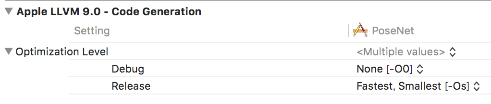

# PoseNet-CoreML

[PoseNet](https://github.com/tensorflow/tfjs-models/tree/master/posenet) Based iOS Project

I checked the performance by running PoseNet on CoreML


## Environment
* iOS11
* Xcode9


## Installation

```
$ cd iOS
$ pod install
```

## Performance

Test Device: iPhone7

```
// size 513 
0.13 - 0.18 seconds.

// size 337
0.06 - 0.12 seconds.

// size 257
0.06 - 0.09 seconds.
```

Setting Optimization Level  
Edit Scheme -> Build Configuration -> Selected Release  




## Dependencies

* [raywenderlich/swift-algorithm-club](https://github.com/raywenderlich/swift-algorithm-club)
* [hollance/CoreMLHelpers](https://github.com/hollance/CoreMLHelpers)
* [qoncept/TensorSwift](https://github.com/qoncept/TensorSwift)

# Blogs

* [PoseNetをマルチプラットフォームで実装してみた](https://qiita.com/otmb/items/561a62d3413295cc744e)

## Development By Infocom TPO

[Infocom TPO](https://lab.infocom.co.jp/)

## License

PoseNet-CoreML is available under the MIT license. See the LICENSE file for more info.
